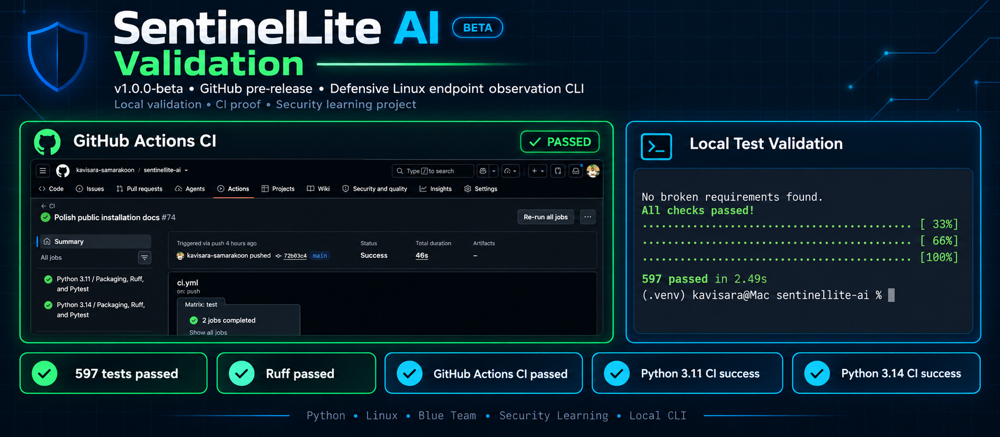
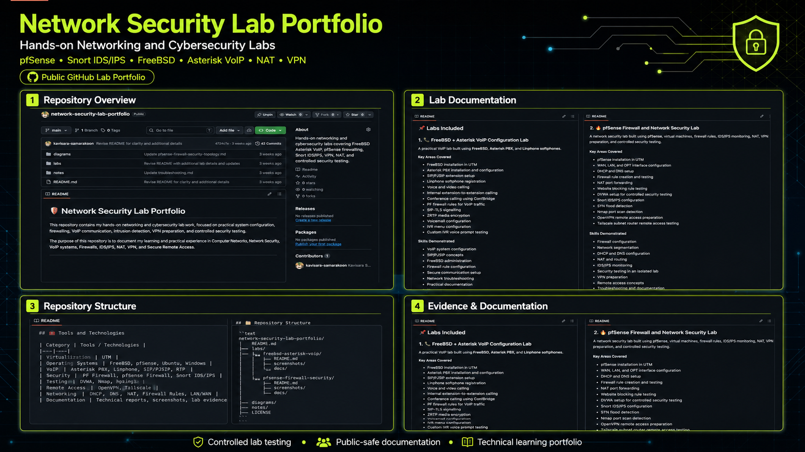
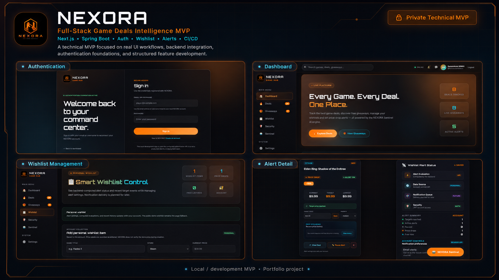

<!-- GitHub Profile README -->

  

<h1 align="center">Hi, I'm Kavisara Samarakoon 👋</h1>

  <b>Computer Networks Student</b> · <b>Cybersecurity & Network Engineering Focus</b> · <b>Secure Full-Stack Development</b>

  

  
  
  

---

## 👨‍💻 About Me

I am a **BSc (Hons) Computer Networks undergraduate at NSBM Green University**, Sri Lanka, and a **BIT External undergraduate at the University of Moratuwa**.

My main career direction is **Cybersecurity Analysis and Network Engineering**. I enjoy learning by building practical labs, testing real configurations, documenting technical work, and developing secure full-stack projects.

I focus on connecting **networking, cybersecurity, systems administration, cloud fundamentals, and software development** into practical project-based learning.

---

## 🎯 Current Focus

- Developing **SentinelLite AI**, a public beta-stage defensive endpoint observation CLI
- Building practical **networking and cybersecurity labs**
- Improving skills in **Linux security, authentication logs, file integrity checks, rule-based detection, and defensive security tooling**
- Developing **NEXORA**, a private full-stack technical MVP
- Strengthening **Spring Boot, Next.js, API design, GitHub Actions, and CI/CD**
- Preparing for a career as a **Cybersecurity Analyst and Network Engineer**

---

## 🚀 Featured Work

### 🛡️ SentinelLite AI

  

**SentinelLite AI** is a public beta-stage defensive endpoint observation CLI built with Python for Linux-focused security learning, local blue-team analysis, and portfolio demonstration.

It supports authentication log analysis, process observation, active network connection observation, selected file integrity checks, baseline-backed comparison, rule-based detection, deterministic risk scoring, JSON alert reports, local report history, TOML configuration, and local alert explanations.

**Current release:** `v1.0.0-beta` GitHub pre-release  
**Validation:** 597 automated tests passed, Ruff passed, pip check passed, and GitHub Actions CI passed with Python 3.11 and Python 3.14 validation.

**Focus:** Python · Linux Security · Endpoint Observation · Auth Logs · File Integrity · Rule-Based Detection · JSON Reports · GitHub Actions

  
  
  

> SentinelLite AI is a local/on-demand defensive learning tool. It is not a production EDR, antivirus, malware remover, SOC platform, enterprise security tool, or real AI/LLM-powered product.

---

### 🧪 Network Security Lab Portfolio

  

A public GitHub portfolio documenting my hands-on networking and cybersecurity lab work.  
It includes practical labs using **FreeBSD, Asterisk VoIP, pfSense, Snort IDS/IPS, NAT, VPN concepts, and controlled security testing**.

**Focus:** Network Security · Firewalling · IDS/IPS · VoIP · NAT · VPN · Technical Documentation

  

---

### 🎮 NEXORA

  

**NEXORA** is a private full-stack game deals and giveaway discovery MVP with dashboard UI, backend API foundation, authentication flow, wishlist features, alert concepts, documentation, and CI/CD workflow usage.

**Focus:** Next.js · Spring Boot · API Design · Auth Foundation · Wishlist · Alerts · GitHub Actions

  

---

### 🌐 Personal Portfolio Website

A modern responsive portfolio website presenting my background, skills, projects, and career direction in cybersecurity, networking, systems, and full-stack development.

**Focus:** Frontend Development · UI/UX · Personal Branding · Responsive Design

  

---

### 🎓 UniMateLK

An academic group project developed for coursework, including source code, backend/frontend work, database usage, documentation, and team-based development.

**Focus:** Java · Academic Project · Team Development · Documentation

  

---

## 🛠️ Technical Stack

### Networking & Cybersecurity

  
  
  
  
  
  
  
  
  

### Full-Stack Development

  

### Tools & Workflow

  

---

## 📌 Project Highlights

| Area | What I’m building |
|---|---|
| **Defensive Security Tooling** | SentinelLite AI beta-stage local CLI, auth log analysis, file integrity checks, rule-based detection, JSON reports |
| **Network Security Labs** | pfSense firewalling, Snort IDS/IPS, NAT, VPN concepts, controlled testing |
| **VoIP Systems** | FreeBSD + Asterisk PBX, SIP/PJSIP, SIP-TLS, ZRTP, voicemail, IVR |
| **Full-Stack Projects** | Next.js frontend, Spring Boot backend, REST APIs, authentication foundations |
| **Documentation** | GitHub README files, lab reports, topology diagrams, technical notes |
| **Workflow** | Git, GitHub, GitHub Actions, milestones, pull requests, CI/CD checks |

---

## 📚 Currently Learning

- Advanced computer networking concepts
- Network security and firewall rule design
- Linux system administration
- Defensive endpoint observation concepts
- Python security tooling foundations
- Secure web application development
- Spring Boot backend architecture
- Next.js frontend development
- CI/CD and GitHub Actions
- Cloud and infrastructure fundamentals

---

## 📊 GitHub Activity

I use GitHub to document practical labs, build full-stack projects, track development milestones, and improve my technical portfolio step by step.

My main focus is not only writing code, but also maintaining clear documentation, clean repositories, validation evidence, and reviewer-friendly project structure.

---

## 🧭 Career Direction

I am working toward becoming a **Cybersecurity Analyst and Network Engineer**.

My goal is to build a strong technical foundation through:

- practical networking labs,
- secure system design,
- defensive cybersecurity learning,
- local security tooling,
- full-stack development projects,
- technical documentation,
- and continuous hands-on practice.

---

## 📫 Connect With Me

  
  
  
  

---

  <b>Networking · Cybersecurity · Defensive Security Tooling · Secure Systems · Full-Stack Development · Technical Documentation</b>

