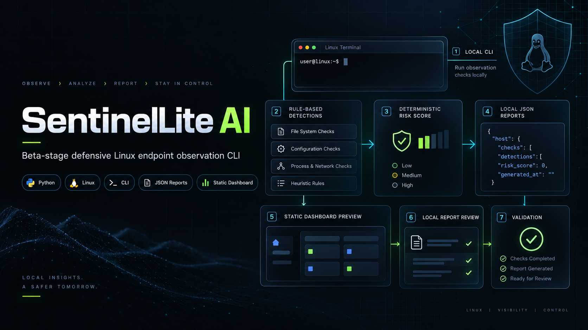
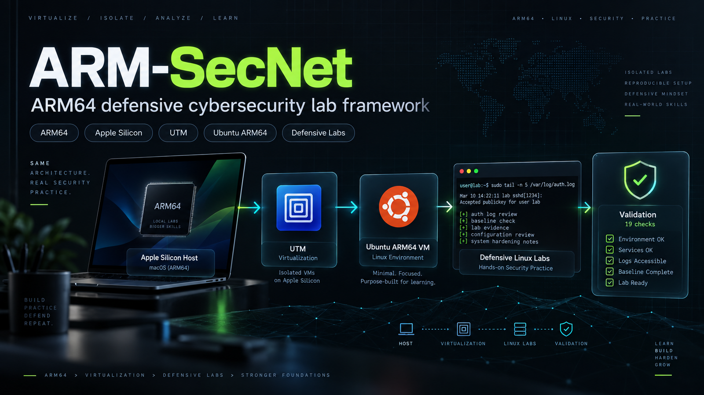

<!-- GitHub Profile README -->

  

<h1 align="center">Hi, I'm Kavisara Samarakoon 👋</h1>

  <b>Computer Networks Student</b> · <b>Cybersecurity & Network Engineering Focus</b> · <b>Secure Full-Stack Development</b>

  

  
  
  

---

## 👨‍💻 About Me

I am a **BSc (Hons) Computer Networks undergraduate at NSBM Green University**, Sri Lanka, and a **BIT External undergraduate at the University of Moratuwa**.

My main career direction is **Cybersecurity Analysis and Network Engineering**. I enjoy learning by building practical labs, testing real configurations, documenting technical work, and developing secure full-stack projects.

I focus on connecting **networking, cybersecurity, systems administration, cloud fundamentals, and software development** into practical project-based learning.

---

## 🎯 Current Focus

- Developing **SentinelLite AI**, a public beta-stage defensive Linux endpoint observation and report-review CLI
- Building **ARM-SecNet**, an ARM64-first defensive cybersecurity lab framework for Apple Silicon users
- Developing **GHOST**, a local-first workflow assistant for project context, sessions, handoffs, and artifacts
- Continuing **NEXORA**, a private full-stack game deals and giveaway discovery MVP
- Improving skills in **Linux security, endpoint observation, file integrity checks, rule-based detection, static dashboards, and defensive lab validation**
- Strengthening **Python, Tauri, React, TypeScript, Rust, Next.js, Spring Boot, GitHub Actions, and CI/CD**
- Preparing for a career as a **Cybersecurity Analyst and Network Engineer**

---

## 🚀 Featured Work

### 🛡️ SentinelLite AI

  

**SentinelLite AI** is a beta-stage defensive Linux endpoint observation and report-review CLI that generates local JSON alert reports and static dashboard views for security learning.

It collects selected host facts when a command is run, applies transparent rules, assigns deterministic risk scores, writes local JSON alert reports, and presents rule-based investigation guidance.

**Current release:** [`v1.2.0-beta`](https://github.com/kavisara-samarakoon/sentinellite-ai/releases/tag/v1.2.0-beta)  
**Validation:** 652 tests passed, Ruff passed, pip check passed, dashboard export works, and Python 3.11 / Python 3.14 CI validation completed.

**Focus:** Python · Linux Security · Endpoint Observation · Auth Logs · File Integrity · Rule-Based Detection · Risk Scoring · JSON Reports · Static Dashboard · GitHub Actions

  
  
  

> SentinelLite AI is a local/on-demand defensive learning tool. It is not a production EDR, antivirus, malware remover, SIEM/SOC platform, enterprise security tool, live monitoring daemon, public scanner, exploit tool, automatic remediation tool, or real AI/LLM-powered product.

---

### 🧪 ARM-SecNet

  

**ARM-SecNet** is a public ARM64-first defensive cybersecurity lab framework for Apple Silicon users, providing UTM-based Linux lab setup, defensive exercises, screenshot-backed evidence, and validation workflows.

It is designed for students, lecturers, and security learners who want reproducible ARM64 Linux security labs using an Apple Silicon Mac, UTM virtualization, Ubuntu ARM64, defensive lab exercises, and validation checks.

**Current release:** [`v1.1.0-sentinellite-dashboard-lab`](https://github.com/kavisara-samarakoon/arm-secnet/releases/tag/v1.1.0-sentinellite-dashboard-lab)  
**Validation:** 29 passed, 0 warnings, 0 failures from local validation, with GitHub Actions validation CI added and passed.

**Current labs:** Linux Baseline Investigation · Authentication Log Analysis · SentinelLite AI Local CLI and Static Dashboard

**Focus:** ARM64 · Apple Silicon · UTM · Ubuntu ARM64 · Defensive Linux Labs · Screenshot Evidence · Lab Validation · GitHub Actions

  
  
  

> ARM-SecNet is a defensive education and lab framework. It is not a production EDR, antivirus, SIEM/SOC platform, malware remover, offensive toolkit, public scanner, automatic remediation tool, or universal ARM64 compatibility proof.

> Note: Existing Lab 03 evidence was recorded on one Ubuntu 26.04 LTS aarch64 VM using a specific SentinelLite source commit. Exact SentinelLite `v1.2.0-beta` wheel validation should be recorded separately in a future release or lab update.

---

### 👻 GHOST

  

**GHOST** stands for **GitHub, Handoff, Operations, Search, and Tracking**.

It is a secure local-first workflow assistant built with **Tauri, React, Rust, and Python** to manage project context, sessions, handoffs, and artifacts through a safe desktop and CLI workflow.

The current public release provides a local MVP desktop checkpoint with a macOS command cockpit, projects, sessions, memory, artifacts, local project/session review, explicit-submit memory search, safe artifact review, Python CLI workflow engine, context pack generation, handoff draft generation, update packs, validation checks, and GitHub Actions CI validation.

**Current public release:** [`v0.3.0-alpha`](https://github.com/kavisara-samarakoon/ghost/releases/tag/v0.3.0-alpha)  
**Status:** Public alpha / local MVP. Latest main is ahead of `v0.3.0-alpha`; `v0.4.0-alpha` is planned next.

**Focus:** Tauri · React · TypeScript · Rust · Python · Local-First Workflow · Project Context · Handoffs · Artifacts · GitHub Actions

  
  
  

> GHOST is a public alpha local MVP. The desktop app does not run shell commands, invoke the Python CLI, call AI APIs, call network services, or automatically publish, deploy, merge, push, tag, or release. Future roadmap items are planned directions, not current implemented features.

---

### 🌐 Personal Portfolio Website

A modern responsive portfolio website presenting my background, skills, projects, and career direction in cybersecurity, networking, systems, and full-stack development.

The portfolio includes full project pages for **SentinelLite AI**, **ARM-SecNet**, **GHOST**, **NEXORA**, networking/security labs, academic projects, and personal technical work.

**Focus:** Frontend Development · UI/UX · Personal Branding · Responsive Design · Project Documentation

  

---

### 🎮 NEXORA

**NEXORA** is a private full-stack game deals and giveaway discovery MVP with dashboard UI, backend API foundation, authentication flow, wishlist features, alert concepts, documentation, and CI/CD workflow usage.

It is designed as a secure, network-aware game deals intelligence platform concept, with future direction toward wishlist price alerts, game discovery, and assistant-supported deal monitoring.

**Status:** Private technical MVP  
**Focus:** Next.js · Spring Boot · PostgreSQL · REST API · Auth Foundation · Wishlist · Alerts · CI/CD · Product Documentation

  

---

## 🛠️ Technical Stack

### Networking & Cybersecurity

  
  
  
  
  
  
  
  
  
  
  
  

### Software Development

  

### Tools, Desktop & Workflow

  

  
  
  
  
  

---

## 📌 Project Highlights

| Area | What I’m building |
|---|---|
| **Defensive Security Tooling** | SentinelLite AI beta-stage local CLI, Linux endpoint observation, rule-based detection, deterministic risk scoring, JSON alert reports, static dashboard export |
| **ARM64 Defensive Labs** | ARM-SecNet lab framework using Apple Silicon, UTM, Ubuntu ARM64, screenshot-backed lab evidence, and validation workflows |
| **Local-First Workflow Systems** | GHOST local MVP for project context, sessions, memory search, handoff drafts, artifacts, and safe desktop/CLI workflows |
| **Network Security Labs** | pfSense firewalling, Snort IDS/IPS, NAT, VPN concepts, controlled testing, and network security documentation |
| **VoIP Systems** | FreeBSD + Asterisk PBX, SIP/PJSIP, SIP-TLS, ZRTP, voicemail, IVR, and controlled VoIP lab testing |
| **Full-Stack Projects** | NEXORA private technical MVP, personal portfolio, Next.js frontend work, Spring Boot backend foundations, REST APIs, and authentication concepts |
| **Documentation & Validation** | GitHub README files, lab reports, release notes, screenshot evidence, validation scripts, GitHub Actions, and reviewer-friendly project structure |

---

## 📚 Currently Learning

- Advanced computer networking concepts
- Network security and firewall rule design
- Linux system administration and security
- Defensive endpoint observation concepts
- File integrity monitoring and baseline comparison
- Rule-based detection, risk scoring, and JSON report design
- ARM64 Linux lab validation using Apple Silicon and UTM
- Local-first desktop workflow development with Tauri, Rust, React, and Python
- Secure web application development with Next.js and Spring Boot
- CI/CD, GitHub Actions, release assets, and technical documentation
- Cloud and infrastructure fundamentals

---

## 📊 GitHub Activity

I use GitHub to document practical labs, build full-stack projects, track development milestones, publish release checkpoints, and improve my technical portfolio step by step.

My main focus is not only writing code, but also maintaining clear documentation, clean repositories, validation evidence, release notes, and reviewer-friendly project structure.

---

## 🧭 Career Direction

I am working toward becoming a **Cybersecurity Analyst and Network Engineer**.

My goal is to build a strong technical foundation through:

- practical networking labs,
- secure system design,
- defensive cybersecurity learning,
- local security tooling,
- ARM64 defensive lab validation,
- local-first workflow tooling,
- full-stack development projects,
- technical documentation,
- and continuous hands-on practice.

---

## 📫 Connect With Me

  
  
  
  

---

  <b>Networking · Cybersecurity · Defensive Security Tooling · ARM64 Labs · Local-First Workflow Systems · Secure Full-Stack Development · Technical Documentation</b>

