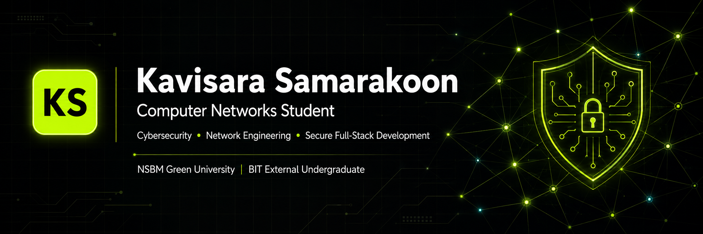

<!-- GitHub Profile README -->

  

<h1 align="center">Hi, I'm Kavisara Samarakoon 👋</h1>

  <b>Computer Networks Student</b> · <b>Cybersecurity & Network Engineering Focus</b> · <b>Secure Full-Stack Development</b>

  

  
  
  

---

## 👨‍💻 About Me

I am a **BSc (Hons) Computer Networks undergraduate at NSBM Green University**, Sri Lanka, and a **BIT External undergraduate at the University of Moratuwa**.

My main career direction is **Cybersecurity Analysis and Network Engineering**. I enjoy learning by building practical labs, testing real configurations, documenting technical work, and developing secure full-stack projects.

I focus on connecting **networking, cybersecurity, systems administration, cloud fundamentals, and software development** into practical project-based learning.

---

## 🎯 Current Focus

- Building practical **networking and cybersecurity labs**
- Improving skills in **network security, firewalls, IDS/IPS, VPN, and secure systems**
- Developing **NEXORA**, a private full-stack technical MVP
- Strengthening **Spring Boot, Next.js, API design, GitHub Actions, and CI/CD**
- Preparing for a career as a **Cybersecurity Analyst and Network Engineer**

---

## 🚀 Featured Work

<table>
  <tr>
    <td width="50%">
      <h3>🛡️ Network Security Lab Portfolio</h3>
      

        A public GitHub portfolio documenting practical networking and cybersecurity labs using
        FreeBSD, Asterisk VoIP, pfSense, Snort IDS/IPS, NAT, VPN concepts, and controlled security testing.
      

      

        <b>Focus:</b> Network Security · Firewalling · IDS/IPS · VoIP · VPN · Technical Documentation
      

      
    </td>
    <td width="50%">
      <h3>🌐 Personal Portfolio Website</h3>
      

        A modern responsive portfolio website presenting my background, skills, projects,
        and career direction in cybersecurity, networking, systems, and full-stack development.
      

      

        <b>Focus:</b> Frontend Development · UI/UX · Personal Branding · Responsive Design
      

      
    </td>
  </tr>
  <tr>
    <td width="50%">
      <h3>🎮 NEXORA</h3>
      

        A private full-stack game deals and giveaway discovery MVP with dashboard UI,
        backend API foundation, authentication flow, wishlist features, alert concepts,
        technical documentation, and CI/CD workflow usage.
      

      

        <b>Focus:</b> Next.js · Spring Boot · API Design · Auth Foundation · GitHub Actions
      

      
    </td>
    <td width="50%">
      <h3>🎓 UniMateLK</h3>
      

        An academic group project developed for coursework, including source code,
        backend/frontend work, database usage, documentation, and team-based development.
      

      

        <b>Focus:</b> Java · Academic Project · Team Development · Documentation
      

      
    </td>
  </tr>
</table>

---

## 🛠️ Technical Stack

### Networking & Cybersecurity

  
  
  
  
  
  
  

### Full-Stack Development

  

### Tools & Workflow

  

---

## 📌 Project Highlights

| Area | What I’m building |
|---|---|
| **Network Security Labs** | pfSense firewalling, Snort IDS/IPS, NAT, VPN concepts, controlled testing |
| **VoIP Systems** | FreeBSD + Asterisk PBX, SIP/PJSIP, SIP-TLS, ZRTP, voicemail, IVR |
| **Full-Stack Projects** | Next.js frontend, Spring Boot backend, REST APIs, authentication foundations |
| **Documentation** | GitHub README files, lab reports, topology diagrams, technical notes |
| **Workflow** | Git, GitHub, GitHub Actions, milestones, pull requests, CI/CD checks |

---

## 📚 Currently Learning

- Advanced computer networking concepts
- Network security and firewall rule design
- Linux system administration
- Secure web application development
- Spring Boot backend architecture
- Next.js frontend development
- CI/CD and GitHub Actions
- Cloud and infrastructure fundamentals

---

## 📊 GitHub Activity

  

  

---

## 🧭 Career Direction

I am working toward becoming a **Cybersecurity Analyst and Network Engineer**.

My goal is to build a strong technical foundation through:

- practical networking labs,
- secure system design,
- defensive cybersecurity learning,
- full-stack development projects,
- technical documentation,
- and continuous hands-on practice.

---

## 📫 Connect With Me

  
  
  
  

---

  <b>Networking · Cybersecurity · Secure Systems · Full-Stack Development · Technical Documentation</b>

  

